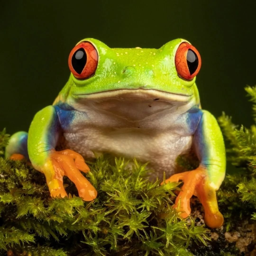
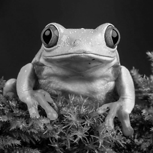
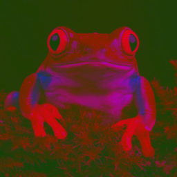

# Преобразование цвета в один тон

Представленный алгоритм позволяет трансформировать цвета изображения таким образом, чтобы при конвертации в режим оттенков серого картинка исчезала.

<blockquote>

Например, если конвертировать обычное изображение в режим оттенков серого, получится примерно следующее:

<div style="display: flex; flex-direction: row; flex-wrap: nowrap; flex-flow: row nowrap; justify-content: flex-start; align-items: center; margin: 0 0 1rem 0">
    
    <div style="font-size: 1.5rem; margin: 0 0.5rem;">→</div>
    
</div>

Но если перед конвертацией в режим оттенков серого применить представленный алгоритм, то получится следующий результат:

<div style="display: flex; flex-direction: row; flex-wrap: nowrap; flex-flow: row nowrap; justify-content: flex-start; align-items: center; margin: 0 0 1rem 0">
    
    <div style="font-size: 1.5rem; margin: 0 0.5rem;">→</div>
    
    <div style="font-size: 1.5rem; margin: 0 0.5rem;">→</div>
    
</div>

То есть картинка посередине не может быть конвертирована в режим оттенков серого, потому что вместо ожидаемого результата получается однотонное пустое изображение.

</blockquote>

## Более подробно

Для конвертации цветного изображения с каналами $(R, G, B)$ в режим оттенков серого с одним каналом $(L)$, как правило, используют среднее взвешенное:

$L=0.2126R + 0.7152G + 0.0722B$

Данные коэффициенты, взятые из стандарта ITU-R BT.709, учитывают разную чувствительность человеческого глаза к тем или иным цветам и являются наиболее распространенными для преобразования изображений в режим оттенков серого.

Если каждый пиксель изображения при переводе в режим оттенков серого преобразуется в одно и то же значение, то в некотором смысле данное изображение является однотонным. То есть все его цвета воспринимается человеческим глазом примерно равными по шкале от "темно" до "светло".

## Принцип работы
Для преобразования решается следующая задача:

$
\begin{cases}
c_r R + c_g G + c_b B = t &(1)
\\
0 \le R, G, B \le 255 &(2)
\\
(R-R_0)^2+(G-G_0)^2+(B-B_0)^2 \to min &(3)
\end{cases}
$

где:
- $(R_0, G_0, B_0)$ - исходный цвет;
- $(R, G, B)$ - итоговый (новый) цвет после преобразования;
- $(c_r, c_g, c_b)$ - коэффициенты для преобразования в режим оттенков серого, по умолчанию берутся значения $(0.2126, 0.7152, 0.0722)$;
- $t$ - целевое значение после преобразование в режим оттенков серого.

> То есть необходимо найти такую точку $(R, G, B)$, которая бы лежала на плоскости $(1)$, удовлетворяла ограничениям $(2)$, а также находилась на минимально возможном расстоянии от точки $(R_0, G_0, B_0)$.

Очевидно, что самый короткий путь до плоскости проходит по перпендикуляру к ней. Однако точка, полученная таким образом, хоть и является идеальной с точки зрения расстояния, не всегда удовлетворяет ограничениям $(2)$. В таком случае необходимо найти ближайшую к ней точку, удовлетворяющую ограничениям. Эта точка располагается на границах сечения куба ограничений $(2)$ плоскостью $(1)$. Найденная таким образом точка является ответом.


## Использование
Для работы алгоритма требуются следующие библиотеки:
- [NumPy](https://numpy.org/) `v1.26.3` (используется для работы с массивами);
- [Pillow](https://pillow.readthedocs.io/en/stable/) `v10.2.0` (используется для работы с изображениями).

Пример преобразования изображения "*sample.png*", лежащего в папке "*input/*":

```Python
from utils import transform

transform('sample.png', target=0.2)
```

Результат по умолчанию будет сохранен по адресу: "*output/output.png*".
Больше подробностей в ноутбуке `main.ipynb`.