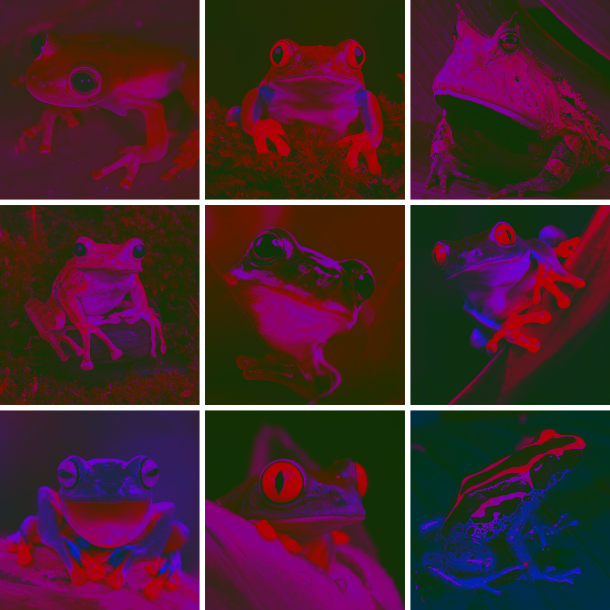

<h1 align="right">
<a href="EN.md">🇺🇸</a> 
<code>🇷🇺</code>
<br>
<div align="left">Выравнивание тона изображения по оттенкам серого</div>
</h1>

Представленный алгоритм позволяет трансформировать цвета изображения таким образом, чтобы при конвертации в режим оттенков серого картинка исчезала.

> Например, если конвертировать обычное изображение в режим оттенков серого, получится примерно следующее:
> 
> 
>
> Но если перед конвертацией в режим оттенков серого применить представленный алгоритм, то получится следующий результат:
> 
> 
> 
> То есть картинка посередине не может быть конвертирована в режим оттенков серого, ведь вместо ожидаемого результата получается однотонное пустое изображение.

## Конвертация в оттенки серого

Для конвертации цветного изображения с каналами $(R, G, B)$ в режим оттенков серого с одним каналом $(L)$, как правило, используют среднее взвешенное:

$L=0.2126R + 0.7152G + 0.0722B$

Данные коэффициенты, взятые из стандарта ITU-R BT.709, учитывают разную чувствительность человеческого глаза к тем или иным цветам и являются наиболее распространенными для преобразования изображений в режим оттенков серого.

Если каждый пиксель изображения при переводе в режим оттенков серого преобразуется в одно и то же значение, то в некотором смысле данное изображение является однотонным. То есть все его цвета воспринимается человеческим глазом примерно равными по шкале от "темно" до "светло".

## Принцип работы
Для преобразования решается следующая задача:

$$
\begin{cases}
c_r R + c_g G + c_b B = t &(1)
\\
0 \le R, G, B \le 255 &(2)
\\
(R-R_0)^2+(G-G_0)^2+(B-B_0)^2 \to min &(3)
\end{cases}
$$

где:
- $(R_0, G_0, B_0)$ - исходный цвет;
- $(R, G, B)$ - итоговый (новый) цвет после преобразования;
- $(c_r, c_g, c_b)$ - коэффициенты для преобразования в режим оттенков серого, по умолчанию берутся значения $(0.2126, 0.7152, 0.0722)$;
- $t$ - целевое значение после преобразование в режим оттенков серого.

> То есть необходимо найти такую точку $(R, G, B)$, которая бы лежала на плоскости $(1)$, удовлетворяла ограничениям $(2)$, а также находилась на минимально возможном расстоянии от точки $(R_0, G_0, B_0)$.

Очевидно, что самый короткий путь до плоскости проходит по перпендикуляру к ней. Однако точка, полученная таким образом, хоть и является идеальной с точки зрения расстояния, не всегда удовлетворяет ограничениям $(2)$. В таком случае необходимо найти ближайшую к ней точку, удовлетворяющую ограничениям. Эта точка располагается на границах сечения куба ограничений $(2)$ плоскостью $(1)$. Найденная таким образом точка является ответом.

## Примеры использования

<details>
<summary>&nbsp;<strong>Основной метод <code>transform()</code></strong></summary>
<blockquote></blockquote>
<blockquote>
Функция <code>transform()</code> - это главный метод, который преобразует изображение таким образом, что при переводе в режим оттенков серого каждый его пиксель окрашивается в один и тот же цвет. Например:<br><br>

```Python
from utils import transform

transform(image_name='frog.png', # путь к исходному изображению
          target=0.15,           # целевое значение в оттенках серого
          test_mode=200)         # разрешение картинки (для тестового режима)
```
Результат:


<details>
<summary>&nbsp;Параметры функции <code>transform()</code> подробно:</summary>
<blockquote></blockquote>

- <kbd>image_name</kbd> - имя файла исходного изображения;
- <kbd>target</kbd> - цель преобразования (значение цвета в режиме оттенков серого) по шкале от 0 до 1. Можно также указать имя файла изображения, которое будет наложено на исходную картинку, и тогда у каждого пикселя будет своя собственная цель;
- <kbd>output_name</kbd> - имя файла для сохранения. Если не указать расширение, по умолчанию будет использоваться *.png*. Если указать *None*, результат сохраняться не будет;
- <kbd>grayscale</kbd> - коэффициенты RGB для преобразования в режим оттенков серого. По умолчанию используются общепризнанные значения (0.2126, 0.7152, 0.0722). В пространстве цветов задают плоскость $\psi: 0.2126R + 0.7152G + 0.0722B = \text{target}$ (или с другими пользовательскими значениями коэффициентов grayscale). Таким образом, любой цвет, принадлежащий плоскости $\psi$, в процессе преобразования в оттенки серого трансформируется в точности в $\text{target}$;
- <kbd>fast_mode</kbd> - при значении True используется быстрый режим, при False - стандартный. Быстрый режим использует неточный алгоритм поиска ближайшего цвета, принадлежащего плоскости $\psi$, поэтому получаемые с его помощью цвета не всегда являются наиболее близкими к исходным, зато его скорость примерно в 2 раза выше, чем у стандартного алгоритма. По умолчанию быстрый режим *выключен*;
- <kbd>test_mode</kbd> - флаг тестового режима, при котором результат преобразования никуда не сохраняется, а исходное изображение уменьшается для ускорения работы алгоритма. Тестовый режим имеет смысл применять для проверки разных значений параметров перед основным преобразованием картинки. По умолчанию режим выключен (значение *False*). Если указать *True*, исходная картинка будет уменьшена до разрешения 100, но можно указать и свое собственное разрешение в качестве значения этого параметра.
</details>
</blockquote>
</details>

<details>
<summary>&nbsp;<strong>Цветовое размытие <code>color_blurring()</code></strong></summary>
<blockquote></blockquote>
<blockquote>
Функция <code>color_blurring()</code> размывает цвета изображения, создавая эффект свечения. Для создания этого эффекта вызывается функция <code>transform()</code>, в которую в качестве изображения передается размытая по Гауссу версия исходной картинки, а в качестве цели передается сама исходная картинка. Например:<br><br>

```Python
from utils import color_blurring
          
color_blurring(image_name='frog.png', # путь к исходному изображению
               blur_factor=0.3,       # степень размытия
               test_mode=200)         # разрешение картинки (для тестового режима)
```
Результат:


<details>
<summary>&nbsp;Параметры функции <code>color_blurring()</code> подробно:</summary>
<blockquote></blockquote>

- <kbd>image_name</kbd> - имя файла исходного изображения;
- <kbd>blur_factor</kbd> - степень размытия по шкале от 0 до 1;
- <kbd>output_name</kbd>, <kbd>grayscale</kbd>, <kbd>fast_mode</kbd>, <kbd>test_mode</kbd> - аргументы функции `transform()`.
</details>
</blockquote>
</details>

<details>
<summary>&nbsp;<strong>Цветное освещение <code>illumination()</code></strong></summary>
<blockquote></blockquote>
<blockquote>
Функция <code>illumination()</code> имитирует цветное освещение (но делает это местами криво). Для создания этого эффекта вызывается функция <code>transform()</code>, в которую передаются такие коэффициенты grayscale, которые заставляют все цвета исходного изображения изменяться в таком пространственном направлении, при котром переданный цвет меняться не будет. Например, если указать цвет (255, 0, 0), то есть красный, то красный канал вообще не будет участвовать в преобразовании, а вот остальные каналы будут корректироваться. Параметр intensity при этом задает степень учета всех остальных (изменяемых) цветов. Чем ниже этот показатель, тем в более низкие (темные) значения будут преобразованы цвета кроме цвета освещения. Подытоживая все вышеперечисленное, функция <code>illumination()</code> с низким значением intensity уменьшает влияние всех цветов кроме указанного. С большим значением intensity влияние всех остальных цветов усиливается. Например:<br><br>

```Python
from utils import illumination

illumination(image_name='frog.png', # путь к исходному изображению
             color=[255, 0, 0],     # цвет освещения
             intensity=0.1,         # изменяемость остальных цветов
             test_mode=200)         # разрешение картинки (для тестового режима)
```
Результат:


<details>
<summary>&nbsp;Параметры функции <code>illumination()</code> подробно:</summary>
<blockquote></blockquote>

- <kbd>image_name</kbd> - имя файла исходного изображения;
- <kbd>intensity</kbd> - степень учета изменяемых цветов от 0 до 1;
- <kbd>color</kbd> - цвет освещения в формате \[R, G, B\], каждое значение от 0 до 255;
- <kbd>output_name</kbd>, <kbd>grayscale</kbd>, <kbd>fast_mode</kbd>, <kbd>test_mode</kbd> - аргументы функции `transform()`.
</details>
</blockquote>
</details>

## Галерея

